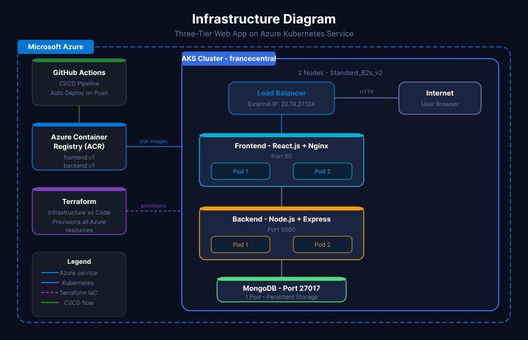
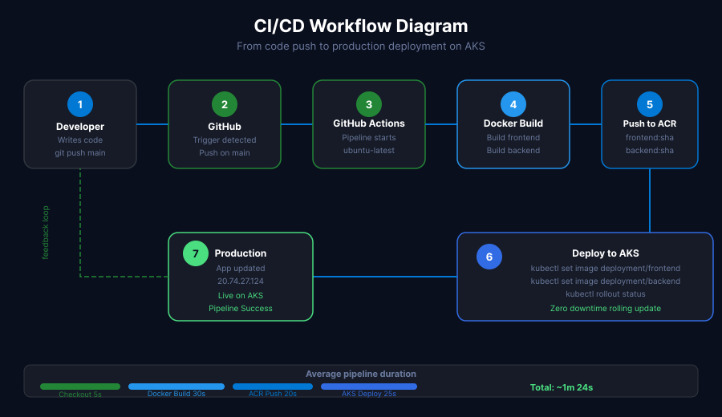
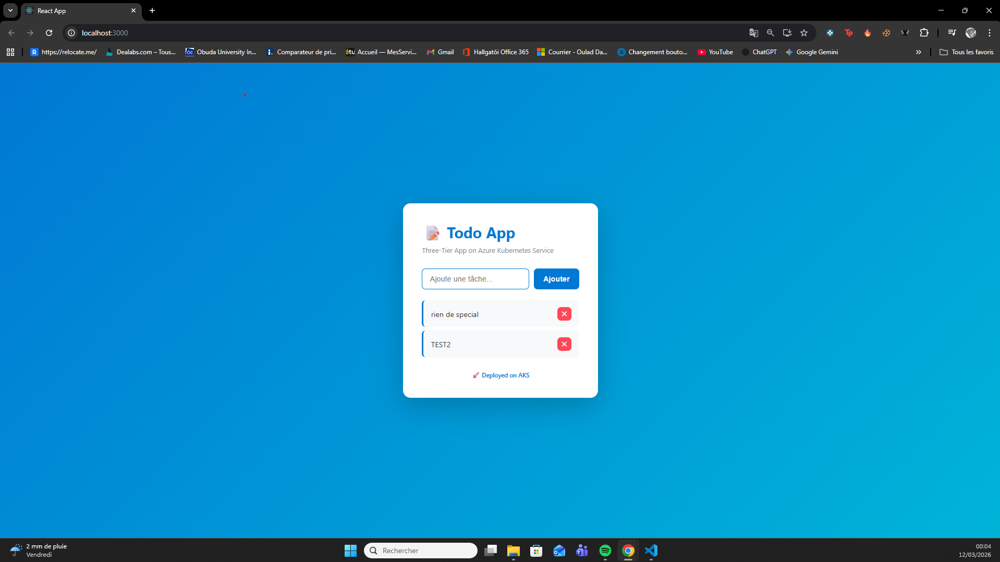
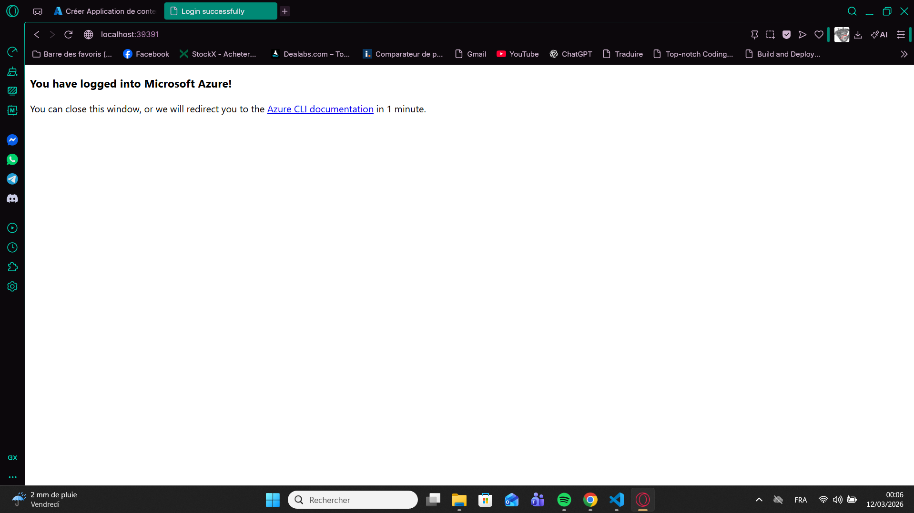
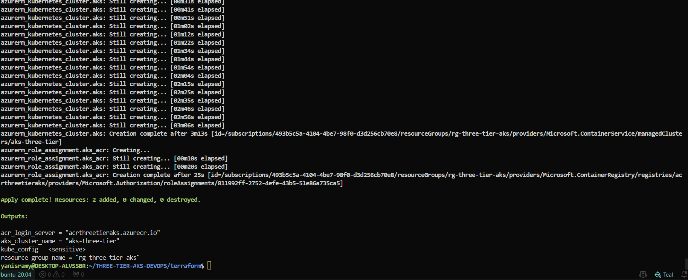
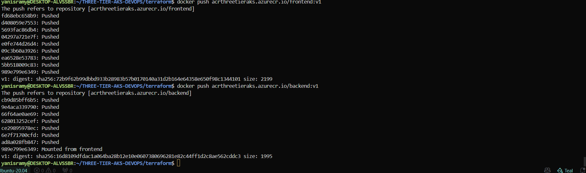
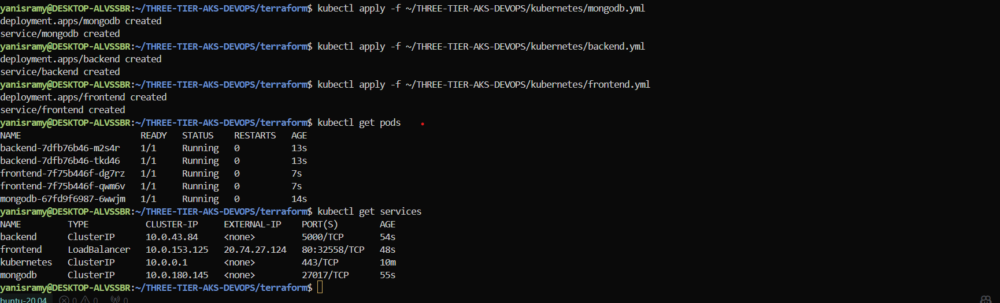
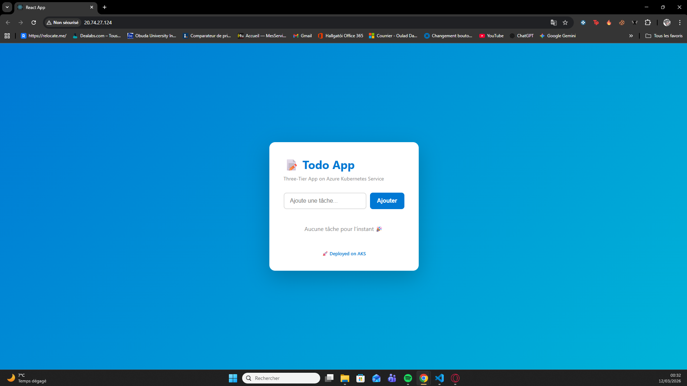
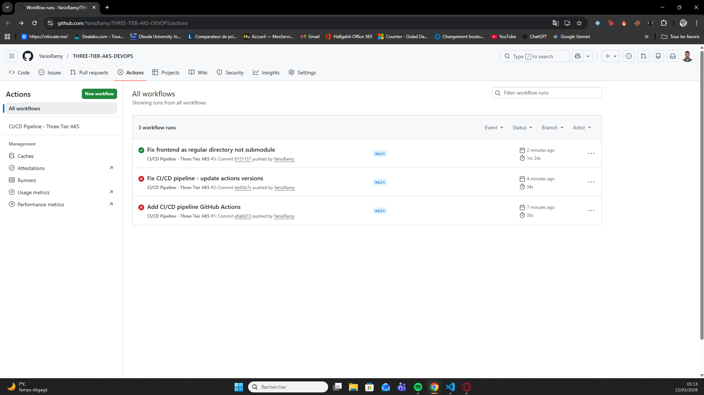

# Three-Tier Web App on Azure Kubernetes Service (AKS)


## Overview

A production-ready three-tier web application deployed on Azure Kubernetes Service (AKS), built with a full DevOps pipeline including Infrastructure as Code, containerization, and CI/CD automation.

The application is a Todo App split into 3 independent layers, each running in its own Docker container, orchestrated by Kubernetes on Microsoft Azure.

---

## Infrastructure Diagram



---

## CI/CD Workflow Diagram



---

## Tech Stack

| Layer | Technology |
|-------|-----------|
| Frontend | React.js, Nginx |
| Backend | Node.js, Express.js |
| Database | MongoDB |
| Containerization | Docker |
| Orchestration | Kubernetes (AKS) |
| Infrastructure as Code | Terraform |
| Container Registry | Azure Container Registry (ACR) |
| CI/CD | GitHub Actions |
| Cloud | Microsoft Azure |

---

## Project Structure
```
THREE-TIER-AKS-DEVOPS/
├── frontend/                 # React.js application
│   ├── src/
│   │   ├── App.js
│   │   └── App.css
│   └── Dockerfile
├── backend/                  # Node.js REST API
│   ├── server.js
│   └── Dockerfile
├── kubernetes/               # Kubernetes manifests
│   ├── frontend.yml
│   ├── backend.yml
│   └── mongodb.yml
├── terraform/                # Infrastructure as Code
│   ├── main.tf
│   ├── variables.tf
│   └── outputs.tf
├── screenshots/              # Project screenshots and diagrams
└── .github/workflows/        # CI/CD Pipeline
    └── ci-cd.yml
```

---

## Getting Started

### Prerequisites

- Azure CLI
- Terraform
- Docker
- kubectl
- Node.js 20+

### 1. Clone the repo
```bash
git clone https://github.com/YanisRamy/THREE-TIER-AKS-DEVOPS.git
cd THREE-TIER-AKS-DEVOPS
```

### 2. Run locally with Docker Compose
```bash
docker compose up --build
```

Visit http://localhost:3000

### 3. Deploy infrastructure on Azure with Terraform
```bash
cd terraform
terraform init
terraform plan
terraform apply
```

This creates:
- A Resource Group in francecentral
- An Azure Container Registry (ACR)
- An AKS cluster with 2 nodes

### 4. Push Docker images to ACR
```bash
az acr login --name acrthreetieraks
docker build -t acrthreetieraks.azurecr.io/frontend:v1 ./frontend
docker build -t acrthreetieraks.azurecr.io/backend:v1 ./backend
docker push acrthreetieraks.azurecr.io/frontend:v1
docker push acrthreetieraks.azurecr.io/backend:v1
```

### 5. Deploy on AKS
```bash
az aks get-credentials --resource-group rg-three-tier-aks --name aks-three-tier
kubectl apply -f kubernetes/
kubectl get pods
kubectl get services
```

---

## CI/CD Pipeline

Every push to the main branch automatically triggers the GitHub Actions pipeline which:

1. Checks out the code
2. Logs into Azure
3. Logs into Azure Container Registry
4. Builds and pushes the Frontend Docker image
5. Builds and pushes the Backend Docker image
6. Connects to the AKS cluster
7. Updates the running deployments with the new images

---

## Azure Infrastructure

| Resource | Name | Region | Details |
|----------|------|--------|---------|
| Resource Group | rg-three-tier-aks | francecentral | Contains all resources |
| AKS Cluster | aks-three-tier | francecentral | 2 nodes, Standard_B2s_v2 |
| Container Registry | acrthreetieraks | francecentral | Basic SKU |

---

## Screenshots

### App running locally with Docker Compose


### Azure login from Ubuntu CLI


### Azure infrastructure created with Terraform


### Docker images pushed to Azure Container Registry


### App live on Azure - First deployment


### App live on Azure - Running in production


### CI/CD Pipeline success on GitHub Actions


---

## Author

Yanis Ramy
- GitHub: https://github.com/YanisRamy
- Email: yanisramy4@gmail.com
